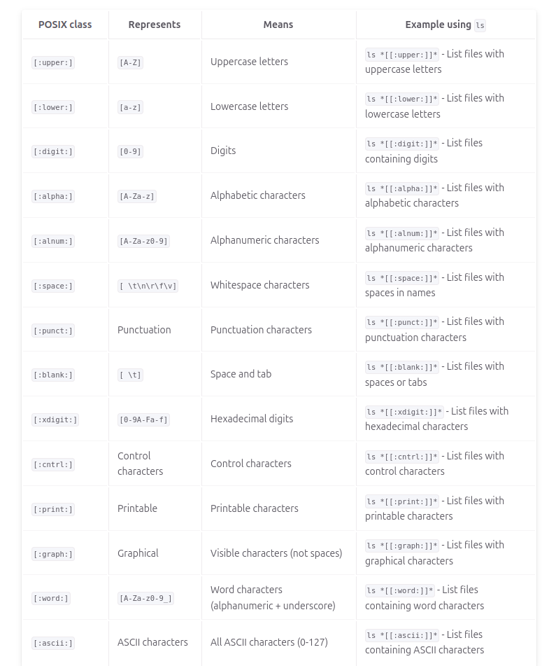
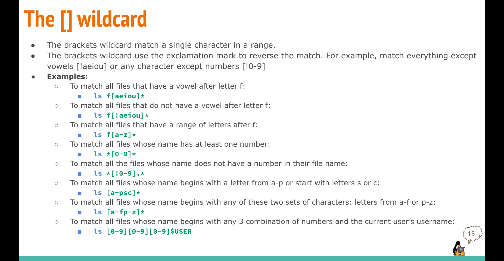
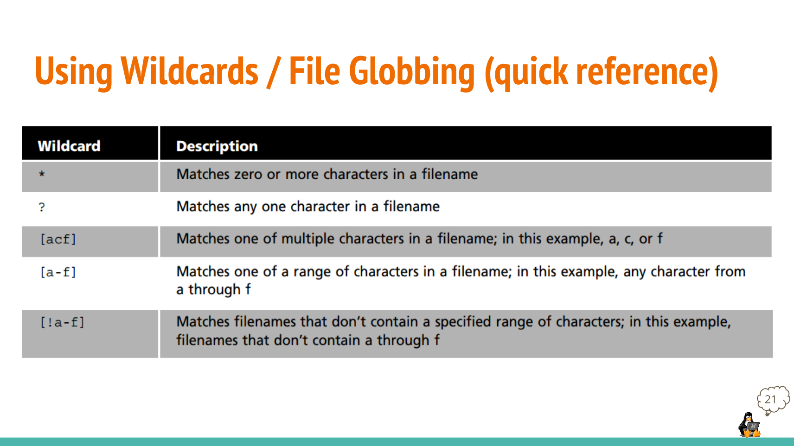
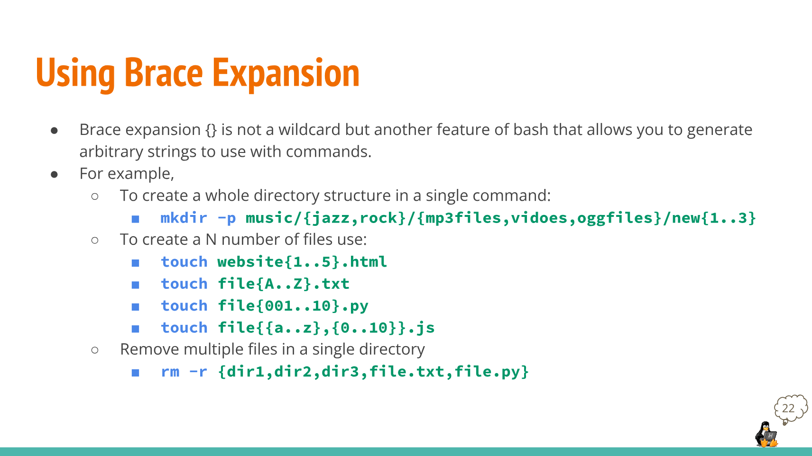

### Notes 6
## Using Wildcards/ File Globbing

---

##### Description;
* Wildcards or file globing is a shell feature that, using special characters, allows us to rapidly specify groups of filenames. Because we work with files all the time, it is useful to be able to work with multiple files at the same time.

---

##### Why and when should I use a wildcard?
Using wildcards can save you a lot of time. Imagine you need to move all the text files in a folder. You could move them one by one—if you know each file’s name. But what if there are 300 files? Moving them one at a time would take forever! Wildcards help you by allowing you to match all files that meet a certain pattern or criteria, so you can move them all at once with a single command. 
###### Here are some examples:
* Copy all photos from a drive to a flash drive.
* Delete certain types of files from a folder.
* List all files that have a date in their name.
###### Wildcard 	definition 	example:
*  (* )	matches 0 to any number of characters 	ls ~/Downloads/*.png
* ? 	matches 1 character 	ls ~/Downloads/f?ll.sh
* [] 	matches 1 character from a set 	ls ~/Downloads/f[0-9]ll.sh

---

##### The * (star/asterisk) wildcard:
* Examples:

  * list all of the directories inside a given directory without listing their content
      * ls -1d wildcard_extra_practice/*/
  *  move all the .sh (shell scripts) files
       * mv wildcard_extra_practice/*.sh wildcard_extra_practice/scripts/
    * list and then move all the image files in the wildcard_extra_practice directory. You will need to create a directory first.
      *  mkdir wildcard_extra_practice/images/
       * ls wildcard_extra_practice/img-*.*
        * mv -v wildcard_extra_practice/img-*.*images/
  
  ---

##### The ? (question mark) wildcard:
* Examples:

    * List all the files that contain a 4 letter file extension.
       * ls -1X wildcard_extra_practice/*.????
    * List all the files that contain a 4 letter file extension and start with letter i:
       * ls -1X wildcard_extra_practice/i*.????
   * List all th files Microsoft Office 365 files.
       * ls -1X wildcard_extra_practice/*.???x

---

##### The [] (square brackets) wildcard:
* Examples:

   * List all the files that start with a capital letter
       * ls wildcard_extra_practice/[A-Z]*
   * List all the files that contain a number in their name
       * `ls wildcard_extra_practice/[0-9]

---

##### Note:

* Wildcards also have their limitations.
   * For instance, “List all the files that do not contain a digit in the file name” You may assume that the approach would be ls *[!0-9]*. However, this does not work. This wildcard translates to:
    “all files and directories in the current directory whose names contain at least one character that is not a digit (0-9)” However, if you ever need this, here are two approaches:
      *  Use ls + grep:
         * ls *[!0-9]* | grep -v '[0-9]'
      *  Use find:
      *    find ./ -not -name '*[0-9]*'
    * Find is preferred for scripts because ls is not suited for shell scripts. ls is intended to be a human friendly tool and the output is difficult to parse properly.

----

##### Extra Screenshots

