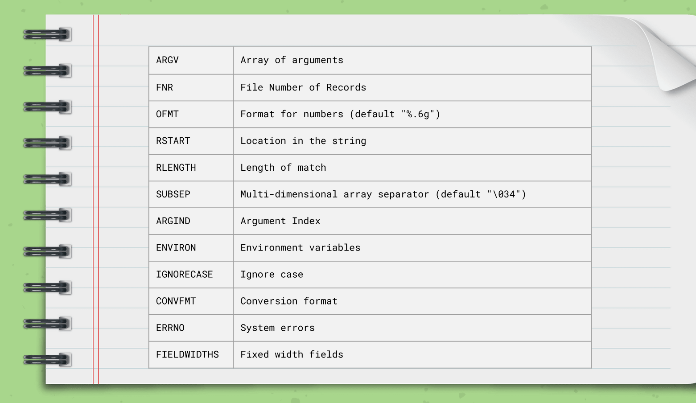
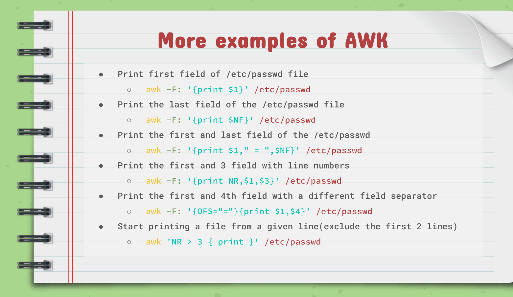
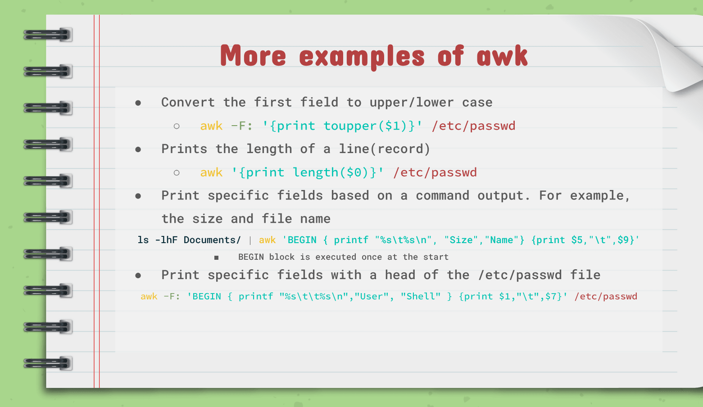
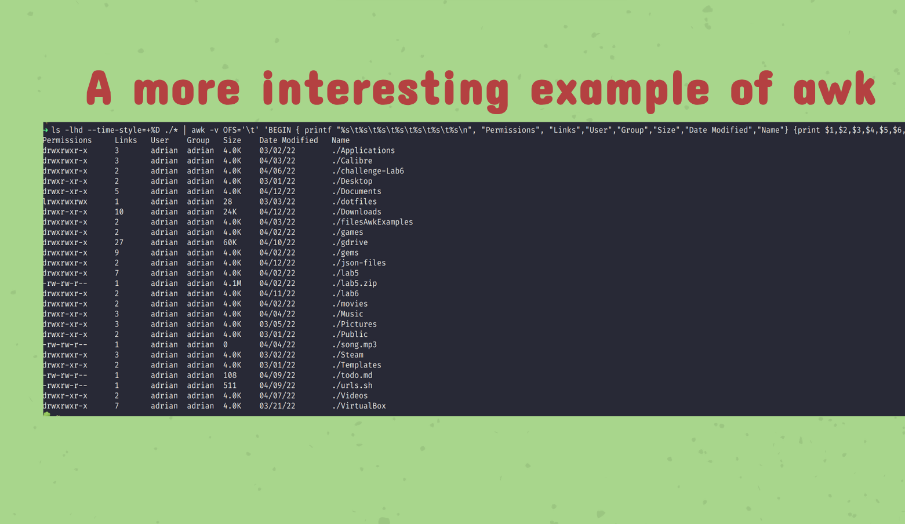

### Notes 7
## Handling Text Files

---

##### The cat Command:
 
 * Description: 
   * The cat command is used for displaying the content of a file.
   * Cat is short for concatenate which is the command's intended use.
* Usage:
  *  cat + option +file(s) to display
* Examples: 
  * Display the content of a file located in the pwd; cat todo.lst 
  * Display the content of a file using absolute path; cat ~/Documents/todo.lst
* More examples of cat:
  
   
  
---

  ##### The tac Command:

* Description: 
    * The tac command is used for displaying the content of a file in reverse order.
    * Just like cat, tac concatenates files and displays the output of the concatenation.
 * Usage: 
   * tac + option + file(s) to display
 * Examples:
   * Display the content of a file located in the pwd;tac todo.md
   * Display the content of a file using absolute path; tac ~/Documents/todo.md
  
---

 ##### The head Command:

* Description:
  * THe head command displays the top N number of lines of a given file.By default, it prints the first 10 lines. If more than one file name is provided then data from each file is preceded by its file name.
* Usage: 
  * head + option + file(s) 
* Examples:
  * Display the first 10 lines of a file; head ~/Documents/Book/dracula.txt 
  * Display the first 5 lines of a file; head -5 ~/Documents/Book/dracula.txt
* More Examples of head:
  
  

---

##### The tail Command:

* Description:
  * The tail command displays the last N number of lines of a given file. By default, it prints the first 10 lines. If more than one file name is provided then data from each file is preceded by its file name.
* Usage: 
  * tail + option + file
* Examples:
  * Display the last 10 lines of a file; tail ~/Documents/Book/dracula.txt
  * Display the last 5 lines of a file; tail -5 ~/Documents/Book/dracula.txt
* More Examples of tail:
  
  

---

##### The cut Command:

* Description:
  * The cut command is used to extract a specific section of each line of a file and display it to the screen.
* Usage: 
  * cut + option + file(s)
* Examples:
  * Display a list of all the users in your system; cut -d ':' -f1 /etc/passwd
  * Display a list of all the users in your system with their login shell; cut -d ':' -f1,7 /etc/passwd
* More Examples of cut:
 
 

---

##### The paste Command:

---

##### The sort Command:

---

##### The wc Command:

---

##### The tr Command:

---

##### The diff Command:

---

##### The grep Command:

* Description:
  * Grep is used to search text in given file. Grep works line by line basis (it matches the search criteria ina line by line basis).
* Usage:
  * grep + option + search criteria + file(s)
* Example:
  * search any line that contains the word "dracula" in the given file; grep 'dracula' ~/Documents/dracula.txt
* More Examples of grep:

---

##### The awk Command:

* Description:
  * Awk is a scripting language used for processing and displaying text. Awk can work with a text file or from standard output. Awk was created in Bell labs during the 70s by Alfred Aho, Peter Weinberger, and Brain Kernighan and its name comes from its authors' initials. There are several implementations of Awk: nawk, mawk, gawk, and busybox.  
  * Awk performs operations line by line.
* Usage:
  * awk = option + {awk command} + file + file to save (optional)
* Example:
  * print the first column of every line of a file; awk '{print $1}' ~/Documents/Csv/cars.csv
* More Examples on AWk:
  

