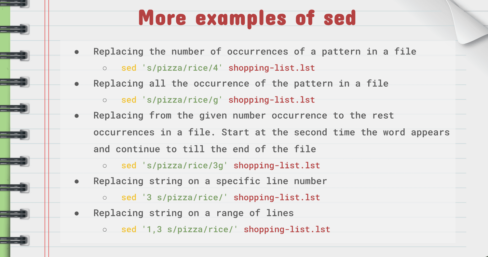
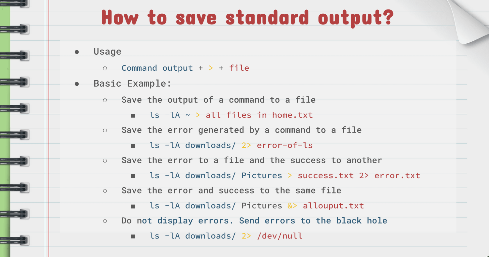

### Notes 7
## Handling Text Files Part #2

---

##### The awk Command:

* Description:
  * Awk is a scripting language used for processing and displaying text. Awk can work with a text file or from standard output. Awk was created in Bell labs during the 70s by Alfred Aho, Peter Weinberger, and Brain Kernighan and its name comes from its authors' initials. There are several implementations of Awk: nawk, mawk, gawk, and busybox.  
  * Awk performs operations line by line.
* Usage:
  * awk = option + {awk command} + file + file to save (optional)
* Example:
  * print the first column of every line of a file; awk '{print $1}' ~/Documents/Csv/cars.csv
* More Examples on AWk:
  

---

##### The sed Command:

* Description:
  * SED is a stream editor that perform operations on files and standard output. For instance it can search, find and replace, inset, and deletion. By using SED you can edit files without opening them.
* Usage: 
  * sed options + sed script + file
* Examples:
  * Replacing a string in given file (replace pizza for rice); sed 's/pizza/rice/' shopping-list.lst
* More Examples on SED:
  

---

##### Less Command:

---

##### More Examples of >, >>, |

