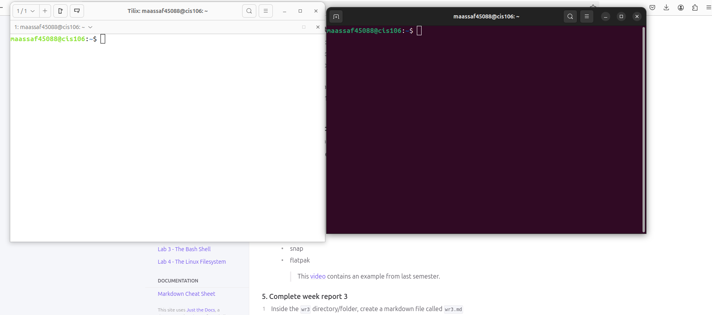
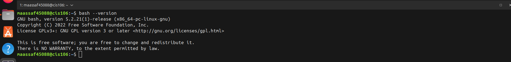
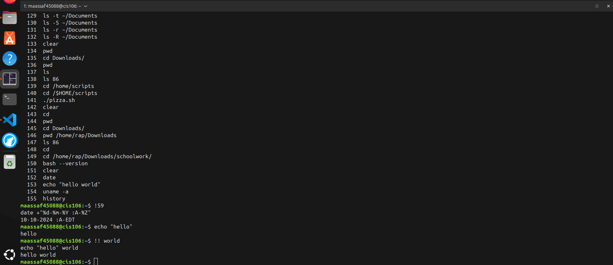
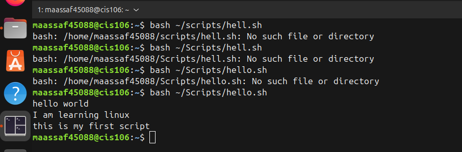
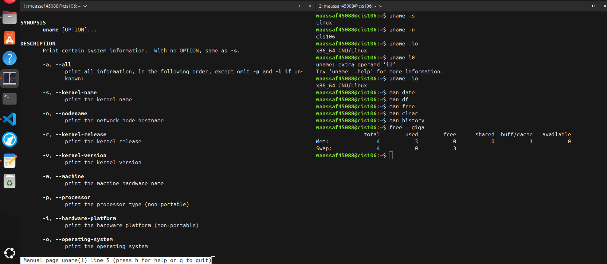
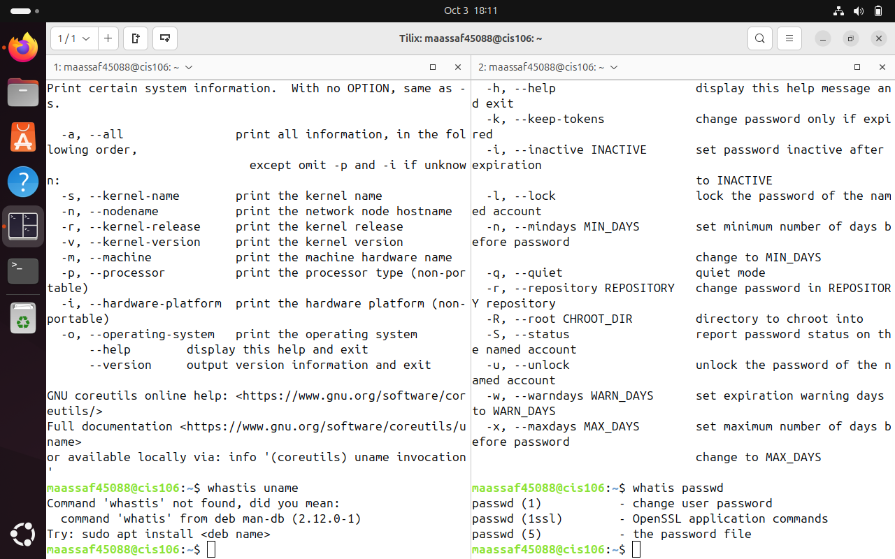
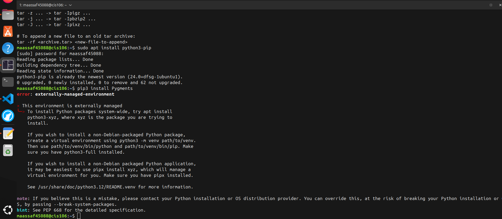
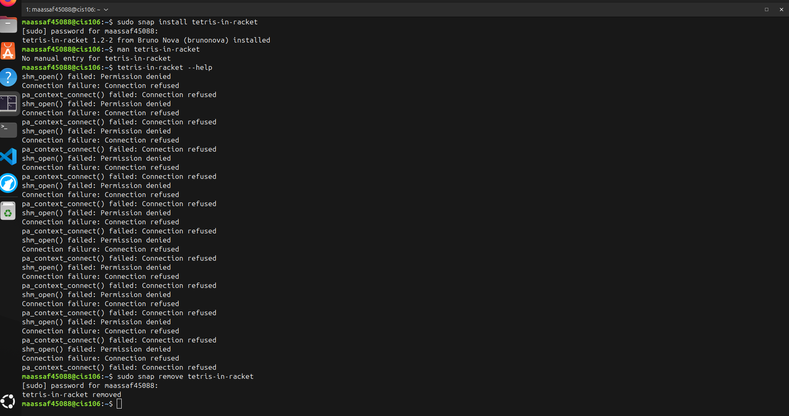
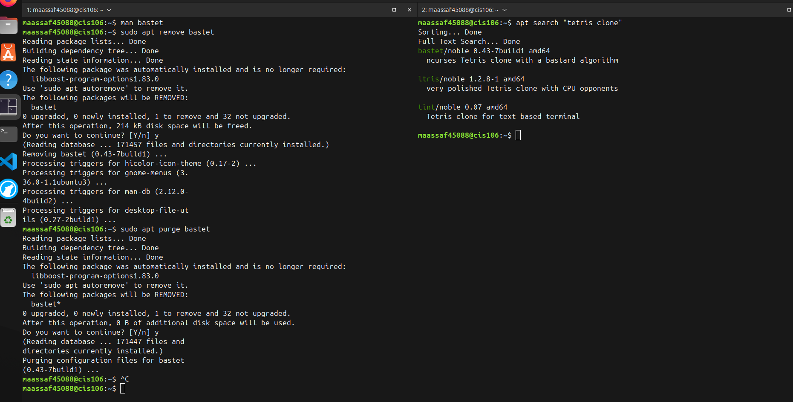

# Week Repott #3

## Completed Work Week #3
* [lab3](../../labs/labs3.md)
* [notes3](../../Notes/notes3/notes3.md)
* [managing software cheatsheet](../../Cheatsheets/managing%20software%20cheatsheet.png)
* [What is a shell](https://docs.google.com/presentation/d/e/2PACX-1vSMW_nt1pQzuvuV3HlZ-3gw9ObsRqnTVSPRW34tPB-cJ_iUgwuVr1iKY8MdWxh4_ctfRq9PDpXPMdif/pub?start=false&amp;loop=false&amp;delayms=3000&pli=1#slide=id.p)
* [Managing Software](https://docs.google.com/presentation/d/e/2PACX-1vR_QKnpK62slS9NygUiRwKyCMaQGlTG401TGJS0l2F9P2UEKWAf7VxkkSgxR5K4rN9RzGjU8hBZb3yj/pub?start=false&loop=false&delayms=3000&pli=1#slide=id.p)

## Practice 
### Practice 1

### Practice 2

### Practice 3

### Practice 4

### Practice 5

### Practice 6

### Practice 7

### Practice 1 Managing Software

### Practice 3 Manging Sodtware
